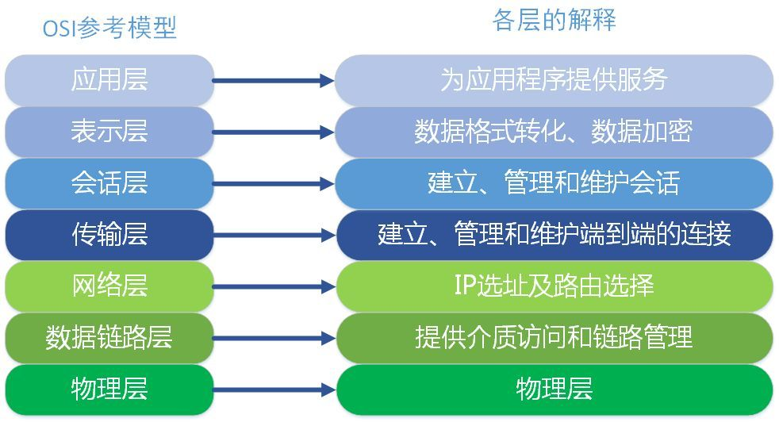
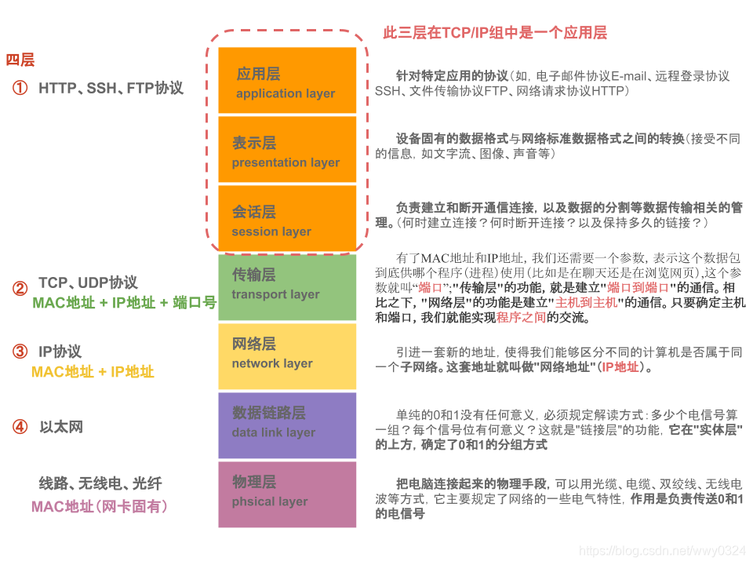

# TCP IP 协议

[TCP/IP 教程](https://www.runoob.com/tcpip/tcpip-tutorial.html)

## OSI(Open System Interconnection Reference Model）七层参考模型

应用层
表示层
会话层

### 内核、公共
传输控制层
网络层
链路层
物理层

- 计算机组成原理

## TCP/IP 协议
